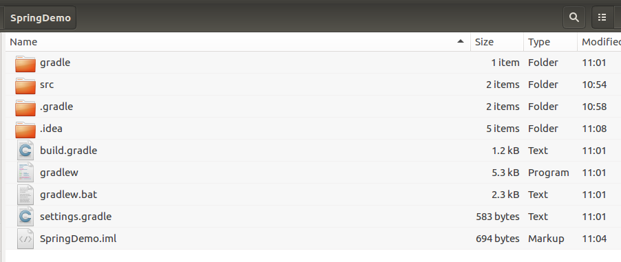

## 创建一个Spring项目

1. 首先创建一个项目仓库（SpringDemo）
```
mkdir SpringDemo
```

2. 创建src目录，src/main/java, src/main/resources, src/test/java, src/test/resources
```
mkdir src
mkdir -p src/main
mkdir -p src/main/java
mkdir -p src/main/resources
mkdir -p src/test/java
mkdir -p src/test/resources
```

3. 使用gradle进行初始化
```
grdale init
```

4. 最终生成目录如下：

